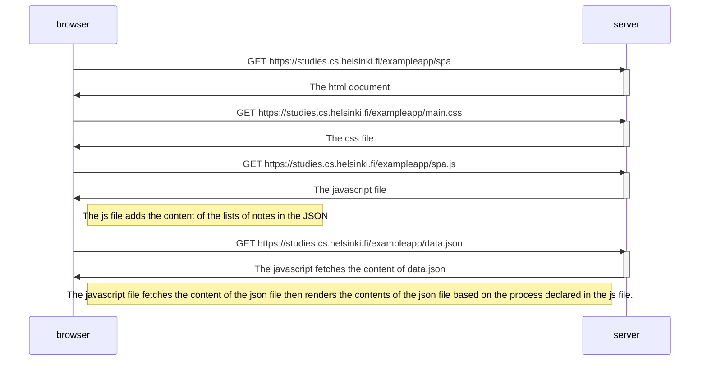

```mermaid
sequenceDiagram 
    participant browser 
    participant server 

    browser->>server: GET https://studies.cs.helsinki.fi/exampleapp/spa 
    activate server 
    server->>browser: The html document 
    deactivate server 

    browser->>server: GET https://studies.cs.helsinki.fi/exampleapp/main.css 
    activate server 
    server->>browser: The css file 
    deactivate server 

    browser->>server: GET https://studies.cs.helsinki.fi/exampleapp/spa.js 
    activate server 
    server->>browser: The javascript file
    deactivate server 

    Note right of browser: The js file adds the content of the lists of notes in the JSON 

    browser->>server: GET https://studies.cs.helsinki.fi/exampleapp/data.json 
    activate server 
    server->>browser: The javascript fetches the content of data.json
    deactivate server 

    Note right of browser: The javascript file fetches the content of the json file then renders the contents of the json file based on the process declared in the js file.
```