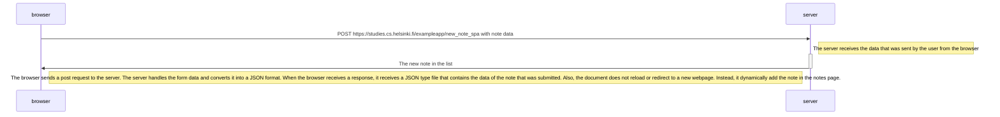

```mermaid
sequenceDiagram 
    participant browser 
    participant server 

    browser->>server: POST https://studies.cs.helsinki.fi/exampleapp/new_note_spa with note data
    Note right of server: The server receives the data that was sent by the user from the browser
    activate server 
    server->>browser: The new note in the list 
    deactivate server 

    Note right of browser: The browser sends a post request to the server. The server handles the form data and converts it into a JSON format. When the browser receives a response, it receives a JSON type file that contains the data of the note that was submitted. Also, the document does not reload or redirect to a new webpage. Instead, it dynamically add the note in the notes page.
```